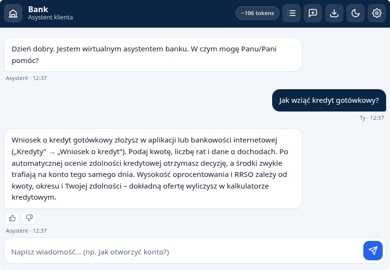

# ChatBankAssist — asystent obsługi klienta banku

[](https://chat-bank-assist.vercel.app/)
[](https://github.com/DolilDev/ChatBankAssist/actions/workflows/deploy.yml)
[](#użyte-technologie-i-dlaczego)
[](#tryb-ai-i-bezpieczeństwo-klucza)

Chatbot obsługi klienta dla banku: frontend w czystym JavaScript (bez frameworków i kroku budowania) z lekkim backendem serverless dla trybu AI. Odpowiedzi powstają z konfigurowalnej bazy wiedzy (FAQ) w trybie lokalnym albo z modelu LLM (Groq, Llama 3.3 70B) w trybie AI — klucz API pozostaje wyłącznie po stronie serwera.

## Linki

| Zasób | Adres |
|---|---|
| Aplikacja | https://chat-bank-assist.vercel.app/ |
| Wersja Voiceflow (osadzona) | https://dolildev.github.io/ChatBankAssist/voiceflow.html |
| Czysty czat Voiceflow | https://creator.voiceflow.com/share/6a1be20d7b492825fac4e318/environment/main/draft |



> _Powyżej: zrzut ekranu interfejsu asystenta._

---

## Cel biznesowy

Banki obsługują tysiące powtarzalnych zapytań dziennie (otwieranie konta, czas przelewu, zastrzeżenie karty). Projekt pokazuje, jak odciążyć infolinię lekkim asystentem 24/7, który:

- odpowiada natychmiast na najczęstsze pytania na podstawie zweryfikowanej bazy wiedzy,
- eskaluje sprawę do konsultanta, gdy nie zna pewnej odpowiedzi, zamiast ją zmyślać,
- łączy szybki tryb offline (baza wiedzy) z trybem AI opartym na tej samej, zweryfikowanej bazie jako kontekście.

---

## Funkcje

- Interfejs czatu z bańkami wiadomości (użytkownik po prawej, asystent po lewej).
- Streaming odpowiedzi słowo po słowie z migającym kursorem.
- Wskaźnik pisania (animowane kropki) podczas generowania odpowiedzi.
- Baza wiedzy ładowana z `knowledge-base.json` — 34 wpisy FAQ w 9 kategoriach (konta, przelewy, karty, bezpieczeństwo, reklamacje, kontakt, kredyty, oszczędności, aplikacja mobilna).
- Dopasowanie odporne na język naturalny — lekki stemming PL (odmiana), tolerancja literówek (Levenshtein ≤ 1) i mostek synonimów PL↔EN, dzięki czemu „przelewy", „przlew" czy „loan" trafiają w ten sam temat.
- Eskalacja do konsultanta z wyraźnym komunikatem i przyciskami kontaktu (telefon, e-mail), gdy brak pewnej odpowiedzi.
- Tryb AI — odpowiedzi generuje model Llama 3.3 70B (Groq) przez backend serverless; klucz API pozostaje po stronie serwera, a przeglądarka rozmawia tylko z własnym endpointem `/api/chat`.
- Tryb lokalny — szybkie odpowiedzi z bazy wiedzy w całości w przeglądarce, bez wysyłania zapytań na serwer.
- Historia czatu w `sessionStorage` — rozmowa zachowuje się po odświeżeniu strony.
- Ocena odpowiedzi (przydatna / nieprzydatna) pod każdą wiadomością asystenta.
- Licznik tokenów — rzeczywisty w trybie AI (z danych zużycia API), szacowany lokalnie w trybie offline.
- Tryb ciemny / jasny z przełącznikiem, zapamiętywany i respektujący ustawienia systemu.
- Wykrywanie języka — odpowiedź w języku pytania (polski lub angielski).
- Podsumowanie rozmowy z listą poruszonych kategorii.
- Chipy z podpowiedziami — gotowe przykładowe pytania, znikające po pierwszej wiadomości.
- Eksport rozmowy do pliku `.txt` wraz z ocenami i podsumowaniem.
- Dostępność (a11y) — `aria-live` na strumieniu odpowiedzi, pułapka fokusu w modalach, zamykanie `Esc` z powrotem fokusu, widoczny `:focus-visible` dla nawigacji klawiaturą.
- Nagłówek `Content-Security-Policy` ograniczający źródła skryptów oraz `connect-src` do własnego backendu (`'self'`).
- Testy jednostkowe rdzenia dopasowania (`node --test`), uruchamiane również w CI.
- CI/CD — walidacja bazy wiedzy, testy, minifikacja CSS/JS, generowanie `sitemap.xml` i automatyczny deployment statycznej części na GitHub Pages.
- Responsywny, profesjonalny wygląd (granat / biel) bez zewnętrznych frameworków CSS.

---

## Jak to działa

Asystent ma dwa tryby:

1. **Tryb lokalny (bez połączenia z modelem)** — pytanie jest normalizowane (m.in. polskie znaki), sprowadzane do rdzeni (lekki stemming PL) i dopasowywane do wpisów `knowledge-base.json` metodą scoringu pokrycia słów kluczowych, z tolerancją literówek (Levenshtein ≤ 1) i mostkiem synonimów PL↔EN. Synonimy liczą się jako jedno pojęcie, więc powtórzenia nie zawyżają wyniku. Brak wpisu powyżej progu pewności skutkuje eskalacją do konsultanta.
2. **Tryb AI (opcjonalny)** — pytanie wraz z bazą wiedzy jako kontekstem trafia do funkcji `/api/chat`, która dokłada klucz Groq po stronie serwera i streamuje odpowiedź modelu Llama 3.3 70B token po tokenie. Model jest instruowany, by odpowiadać wyłącznie na podstawie bazy wiedzy i eskalować, gdy nie zna odpowiedzi.

---

## Wersja no-code (Voiceflow)

Ten sam asystent został odtworzony na platformie no-code Voiceflow, co pozwala zestawić podejście kodowe z wizualnym budowaniem flow. Osadzona wersja znajduje się na stronie [`voiceflow.html`](https://dolildev.github.io/ChatBankAssist/voiceflow.html) (hostowanej na GitHub Pages), a surowy projekt w kreatorze jest dostępny [pod tym adresem](https://creator.voiceflow.com/share/6a1be20d7b492825fac4e318/environment/main/draft).

| Kod (ten projekt) | No-code (Voiceflow) |
|---|---|
| Pełna kontrola | Szybki deployment |
| Zero zależności frontendu | Wizualny flow |
| Testowalny jednostkowo | Gotowa infrastruktura |
| Tryb offline (baza wiedzy) | Integracje jednym kliknięciem |

---

## Tryb AI i bezpieczeństwo klucza

Tryb AI korzysta z modelu **Llama 3.3 70B** udostępnianego przez Groq. Klucz API (`GROQ_API_KEY`) jest przechowywany **wyłącznie po stronie serwera** — jako zmienna środowiskowa funkcji serverless na Vercel. Przeglądarka nigdy go nie widzi: wysyła zapytanie do własnego endpointu `/api/chat`, a ten dokłada klucz i streamuje odpowiedź z Groq z powrotem do klienta (SSE).

Dzięki temu:

- klucz nie znajduje się w repozytorium ani w kodzie wysyłanym do przeglądarki,
- `.gitignore` blokuje pliki `.env`/`*.key`, więc sekret nie trafi do gita przez przypadek,
- funkcja `api/chat.js` ma prosty rate limiting (10 żądań/min na IP) ograniczający nadużycia oraz limity długości wejścia,
- nagłówek `Content-Security-Policy` w `index.html` ogranicza `connect-src` do `'self'` — front rozmawia tylko z własnym backendem.

Tryb lokalny nie wymaga żadnego klucza — działa w całości w przeglądarce na bazie wiedzy.

---

## Deployment

Projekt działa w dwóch miejscach, każde z innym zadaniem:

- **Vercel** — hostuje główną aplikację (`index.html`, `style.css`, `app.js`) oraz funkcję serverless `api/chat.js` realizującą tryb AI. Klucz `GROQ_API_KEY` jest ustawiony jako zmienna środowiskowa projektu na Vercel (**Settings → Environment Variables**). Konfigurację funkcji opisuje `vercel.json` (`memory: 512`, `maxDuration: 30`).
- **GitHub Pages** — hostuje `voiceflow.html` (osadzony czat Voiceflow) oraz statyczne lustro frontendu, publikowane przez GitHub Actions (patrz niżej). Tryb AI nie działa na Pages — wymaga backendu z Vercel.

---

## CI/CD

Statyczna część jest publikowana przez GitHub Actions (`.github/workflows/deploy.yml`). Każdy push do gałęzi `main` uruchamia workflow, który:

- waliduje `knowledge-base.json` (poprawność JSON, minimalna liczba wpisów, wymagane pola),
- uruchamia testy jednostkowe (`node --test`),
- minifikuje CSS (`csso`) i JS (`terser`),
- generuje `sitemap.xml` oraz `robots.txt`,
- publikuje witrynę na GitHub Pages.

---

## Użyte technologie i dlaczego

| Technologia | Po co | Dlaczego właśnie ona |
|---|---|---|
| **Vanilla JS (ES2018+)** | logika frontendu | zero zależności i kroku budowania — kod działa wprost w przeglądarce, łatwy do audytu |
| **HTML5 + CSS3 (zmienne CSS)** | UI, motywy, responsywność | natywne zmienne CSS dają tryb ciemny/jasny bez frameworka |
| **Vercel Functions (Node)** | backend trybu AI | jedna funkcja serverless trzyma klucz po stronie serwera i proxy'uje Groq — bez utrzymywania własnego serwera |
| **Groq (Llama 3.3 70B)** | model językowy trybu AI | szybki inference i streaming SSE; klucz pozostaje na serwerze |
| **Fetch + ReadableStream (SSE)** | streaming odpowiedzi | strumieniowanie token po tokenie bez bibliotek |
| **`knowledge-base.json`** | źródło wiedzy bota | rozdzielenie treści od kodu — baza jest edytowana bez dotykania logiki |
| **GitHub Actions** | CI/CD statycznej części | darmowy, natywny deployment na Pages wraz z walidacją i minifikacją |
| **`terser` + `csso`** | minifikacja | mniejsze pliki na produkcji, źródła pozostają czytelne |
| **`jq`** | walidacja JSON w CI | szybka kontrola poprawności bazy przed publikacją |

Świadomie nie użyto Reacta/Vue, bundlerów ani frameworków CSS po stronie frontendu — celem było pokazanie, że dopracowany produkt da się dostarczyć w czystych technologiach webowych, z minimalnym backendem ograniczonym do bezpiecznego proxy modelu AI.

---

## Przykładowe obsługiwane pytania

Po polsku:

- „Jak otworzyć konto osobiste?"
- „Zgubiłem kartę — jak ją zablokować?"
- „Dostałem podejrzany SMS z banku, co robić?"
- „Jak złożyć reklamację?"

Po angielsku (asystent odpowiada po angielsku):

- „How do I open an account?"
- „How long does an international transfer take?"

Pytanie spoza zakresu (np. „Czy oferujecie ubezpieczenie na życie?") skutkuje eskalacją do konsultanta.

---

## Architektura

Aplikacja jest static-first z minimalnym backendem — frontend wykonuje się w przeglądarce, a tryb AI obsługuje jedna funkcja serverless. Warstwy są wyraźnie rozdzielone:

- **Warstwa prezentacji** — `index.html` (główny czat) i `voiceflow.html` (wariant no-code) oraz wspólny arkusz `style.css` (motywy, responsywność).
- **Rdzeń frontendu** — `app.js` udostępnia moduł `window.BankBot`: normalizację języka, dopasowanie do bazy wiedzy, eskalację oraz komunikację z backendem trybu AI.
- **Backend trybu AI** — `api/chat.js` (funkcja serverless Vercel) proxy'uje zapytania do Groq, trzymając klucz po stronie serwera; konfigurację opisuje `vercel.json`.
- **Baza wiedzy** — `knowledge-base.json` jest jedynym źródłem prawdy; `knowledge-base.md` jest z niego generowany skryptem.
- **Jakość i build** — testy jednostkowe w katalogu `tests/` oraz pipeline CI/CD w `.github/workflows/deploy.yml`.

Struktura plików:

```
index.html              # główna aplikacja czatu (Vercel)
voiceflow.html          # wariant no-code: osadzony czat Voiceflow (GitHub Pages)
style.css               # style (granat/biel, tryb ciemny, responsywność)
app.js                  # logika frontendu (rdzeń window.BankBot)
api/
  └── chat.js           # funkcja serverless Vercel: proxy do Groq (SSE), klucz po stronie serwera
vercel.json             # konfiguracja funkcji (memory 512, maxDuration 30)
knowledge-base.json     # baza wiedzy FAQ (34 wpisy, PL + EN) — jedyne źródło prawdy
knowledge-base.md       # czytelna wersja bazy (generowana z JSON)
scripts/
  └── generate-knowledge-base-md.js  # generator knowledge-base.md z JSON (npm run kb:md)
tests/
  ├── harness.js         # ładuje window.BankBot w Node (atrapy DOM/fetch)
  ├── core.test.js       # testy dopasowania: stemming, literówki, synonimy, eskalacja
  └── kb-md-sync.test.js # pilnuje synchronizacji .md ↔ .json
package.json            # skrypty npm (test, kb:md)
docs/preview.png        # podgląd interfejsu (do README)
.github/workflows/
  └── deploy.yml         # CI/CD: walidacja → testy → minifikacja → sitemap → deploy na GitHub Pages
.gitignore
README.md
```

> `sitemap.xml`, `robots.txt` oraz katalog `dist/` powstają automatycznie podczas deploymentu na GitHub Pages i nie są przechowywane w repozytorium.

---

## Testy i jakość

Logika dopasowania jest czysta i testowalna bez przeglądarki — harness podstawia minimalne atrapy DOM i ładuje rdzeń `window.BankBot` w środowisku Node. Zestaw testów (`node --test`, uruchamiany również w CI) obejmuje normalizację i wykrywanie języka, niezmiennik „każde pytanie z bazy znajduje odpowiedź", jednoznaczne dopasowania, odmianę, literówki, synonimy oraz eskalację dla pytań spoza bazy.

`knowledge-base.json` jest jedynym źródłem prawdy; `knowledge-base.md` jest z niego generowany, a osobny test pilnuje, by oba pliki pozostały spójne.

Dostępność i bezpieczeństwo: treści użytkownika i asystenta renderowane są przez `textContent` (brak wstrzyknięć HTML), `innerHTML` używane jest wyłącznie dla statycznych ikon. Strona aplikacji (`index.html`) wysyła nagłówek `Content-Security-Policy`, a modale mają pułapkę fokusu i obsługę `Esc`.
