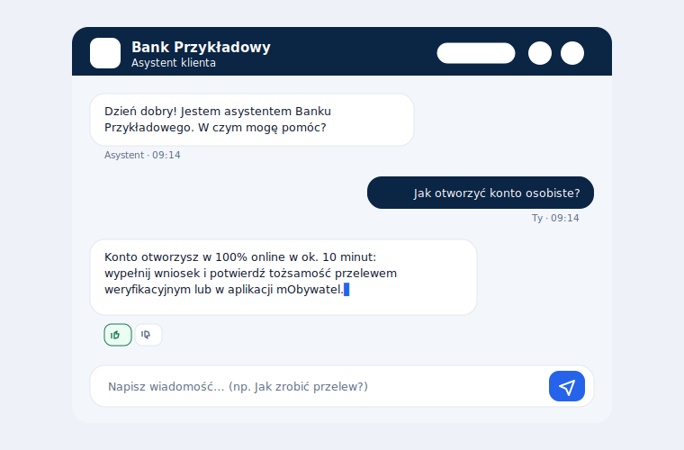

# ChatBankAssist — asystent obsługi klienta banku

[](https://dolildev.github.io/ChatBankAssist/)
[](https://github.com/DolilDev/ChatBankAssist/actions/workflows/deploy.yml)
[](#użyte-technologie-i-dlaczego)
[](#)

Chatbot obsługi klienta dla banku działający w całości w przeglądarce — bez backendu, bez Node.js, bez frameworków. Odpowiedzi powstają na podstawie konfigurowalnej bazy wiedzy (FAQ), a opcjonalnie na podstawie modelu AI (Gemini / Claude / OpenAI) z kluczem API podawanym w interfejsie aplikacji.

## Linki

- Demo: https://dolildev.github.io/ChatBankAssist/
- Demo z kluczem API: https://dolildev.github.io/ChatBankAssist/demo.html
- Wersja Voiceflow (osadzona): https://dolildev.github.io/ChatBankAssist/voiceflow.html
- Czysty czat Voiceflow: https://creator.voiceflow.com/share/6a1be20d7b492825fac4e318/environment/main/draft



> _Powyżej: poglądowa makieta interfejsu asystenta._

---

## Cel biznesowy

Banki obsługują tysiące powtarzalnych zapytań dziennie (otwieranie konta, czas przelewu, zastrzeżenie karty). Projekt pokazuje, jak odciążyć infolinię lekkim asystentem 24/7, który:

- odpowiada natychmiast na najczęstsze pytania na podstawie zweryfikowanej bazy wiedzy,
- eskaluje sprawę do konsultanta, gdy nie zna pewnej odpowiedzi, zamiast ją zmyślać,
- współpracuje z dowolnym modelem LLM bez zmian w kodzie.

Jest to kompletny, produkcyjnie wyglądający przykład podejścia „static-first" — cała logika po stronie klienta, deployment w pełni zautomatyzowany.

---

## Funkcje

- Interfejs czatu z bańkami wiadomości (użytkownik po prawej, asystent po lewej).
- Streaming odpowiedzi słowo po słowie z migającym kursorem.
- Wskaźnik pisania (animowane kropki) podczas generowania odpowiedzi.
- Baza wiedzy ładowana z `knowledge_base.json` — 34 wpisy FAQ w 9 kategoriach (konta, przelewy, karty, bezpieczeństwo, reklamacje, kontakt, kredyty, oszczędności, aplikacja mobilna).
- Dopasowanie odporne na język naturalny — lekki stemming PL (odmiana), tolerancja literówek (Levenshtein ≤ 1) i mostek synonimów PL↔EN, dzięki czemu „przelewy", „przlew" czy „loan" trafiają w ten sam temat.
- Eskalacja do konsultanta z wyraźnym komunikatem i przyciskami kontaktu (telefon, e-mail), gdy brak pewnej odpowiedzi.
- Historia czatu w `sessionStorage` — rozmowa zachowuje się po odświeżeniu strony.
- Ocena odpowiedzi (przydatna / nieprzydatna) pod każdą wiadomością asystenta.
- Licznik tokenów — rzeczywisty w trybie API, szacowany lokalnie w trybie offline.
- Tryb ciemny / jasny z przełącznikiem, zapamiętywany i respektujący ustawienia systemu.
- Wykrywanie języka — odpowiedź w języku pytania (polski lub angielski).
- Podsumowanie rozmowy z listą poruszonych kategorii.
- Tryb API — wybór dostawcy (Gemini / Claude / OpenAI) z kluczem przechowywanym wyłącznie w `sessionStorage`.
- Chipy z podpowiedziami — gotowe przykładowe pytania, znikające po pierwszej wiadomości.
- Eksport rozmowy do pliku `.txt` wraz z ocenami i podsumowaniem.
- Dostępność (a11y) — `aria-live` na strumieniu odpowiedzi, pułapka fokusu w modalach, zamykanie `Esc` z powrotem fokusu, widoczny `:focus-visible` dla nawigacji klawiaturą.
- Nagłówek `Content-Security-Policy` ograniczający źródła skryptów i dozwolone domeny `connect-src` do API dostawców.
- Testy jednostkowe rdzenia dopasowania (`node --test`), uruchamiane również w CI.
- CI/CD — automatyczny deployment na GitHub Pages, testy, minifikacja CSS/JS, walidacja bazy wiedzy i generowanie `sitemap.xml`.
- Responsywny, profesjonalny wygląd (granat / biel) bez zewnętrznych frameworków CSS.

---

## Jak to działa

Asystent ma dwa tryby:

1. **Tryb lokalny (domyślny, bez klucza)** — pytanie jest normalizowane (m.in. polskie znaki), sprowadzane do rdzeni (lekki stemming PL) i dopasowywane do wpisów `knowledge_base.json` metodą scoringu pokrycia słów kluczowych, z tolerancją literówek (Levenshtein ≤ 1) i mostkiem synonimów PL↔EN. Synonimy liczą się jako jedno pojęcie, więc powtórzenia nie zawyżają wyniku. Brak wpisu powyżej progu pewności skutkuje eskalacją do konsultanta.
2. **Tryb API (opcjonalny, z kluczem)** — pytanie wraz z bazą wiedzy jako kontekstem trafia do wybranego modelu LLM, a odpowiedź jest streamowana token po tokenie. Model jest instruowany, by odpowiadać wyłącznie na podstawie bazy wiedzy i eskalować, gdy nie zna odpowiedzi.

---

## Wersja no-code (Voiceflow)

Ten sam asystent został odtworzony na platformie no-code Voiceflow, co pozwala zestawić podejście kodowe z wizualnym budowaniem flow. Osadzona wersja znajduje się na stronie [`voiceflow.html`](https://dolildev.github.io/ChatBankAssist/voiceflow.html), a surowy projekt w kreatorze jest dostępny [pod tym adresem](https://creator.voiceflow.com/share/6a1be20d7b492825fac4e318/environment/main/draft).

| Kod (ten projekt) | No-code (Voiceflow) |
|---|---|
| Pełna kontrola | Szybki deployment |
| Zero zależności | Wizualny flow |
| Testowalny jednostkowo | Gotowa infrastruktura |
| Działa offline | Integracje jednym kliknięciem |

---

## Tryb API i bezpieczeństwo kluczy

Klucz API nie znajduje się w repozytorium ani na żadnym serwerze. Jest wprowadzany dopiero w działającej aplikacji i przechowywany wyłącznie w `sessionStorage` przeglądarki — pamięci, która:

- jest dostępna tylko dla jednej karty i jednej domeny,
- znika z chwilą zamknięcia przeglądarki (w przeciwieństwie do `localStorage`),
- nie jest nigdzie wysyłana — zapytania trafiają bezpośrednio z przeglądarki do API dostawcy.

Klucz umieszczony w kodzie publicznego repozytorium zostałby natychmiast zindeksowany i przejęty przez boty — to jeden z najczęstszych wycieków sekretów. Z tego powodu `.gitignore` blokuje pliki `.env`/`*.key`, a aplikacja z założenia nie ma backendu, który mógłby taki sekret przechować.

Uwaga o CORS: OpenAI oraz Anthropic Claude zwykle blokują zapytania bezpośrednio z przeglądarki (polityka CORS) — bez własnego serwera proxy klucze tych dostawców najczęściej nie zadziałają. W takiej sytuacji aplikacja wyświetla wyraźne ostrzeżenie i rekomenduje Gemini, który jako jedyny działa wprost z przeglądarki.

---

## CI/CD

Deployment jest w pełni zautomatyzowany przez GitHub Actions (`.github/workflows/deploy.yml`). Każdy push do gałęzi `main` uruchamia workflow, który:

- waliduje `knowledge_base.json` (poprawność JSON, minimalna liczba wpisów, wymagane pola),
- minifikuje CSS (`csso`) i JS (`terser`),
- generuje `sitemap.xml` oraz `robots.txt`,
- publikuje witrynę na GitHub Pages.

---

## Użyte technologie i dlaczego

| Technologia | Po co | Dlaczego właśnie ona |
|---|---|---|
| **Vanilla JS (ES2018+)** | cała logika aplikacji | zero zależności i kroku budowania — kod działa wprost w przeglądarce, łatwy do audytu |
| **HTML5 + CSS3 (zmienne CSS)** | UI, motywy, responsywność | natywne zmienne CSS dają tryb ciemny/jasny bez frameworka |
| **Fetch + ReadableStream (SSE)** | streaming odpowiedzi z API | strumieniowanie token po tokenie bez bibliotek |
| **`knowledge_base.json`** | źródło wiedzy bota | rozdzielenie treści od kodu — baza jest edytowana bez dotykania logiki |
| **GitHub Actions** | CI/CD | darmowy, natywny deployment na Pages wraz z walidacją i minifikacją |
| **`terser` + `csso`** | minifikacja | mniejsze pliki na produkcji, źródła pozostają czytelne |
| **`jq`** | walidacja JSON w CI | szybka kontrola poprawności bazy przed publikacją |

Świadomie nie użyto Reacta/Vue, bundlerów ani frameworków CSS — celem było pokazanie, że kompletny, dopracowany produkt da się dostarczyć w czystych technologiach webowych.

---

## Przykładowe obsługiwane pytania

Po polsku:

- „Jak otworzyć konto osobiste?"
- „Ile trwa przelew i kiedy dotrze do odbiorcy?"
- „Zgubiłem kartę — jak ją zablokować?"
- „Jak ustawić zlecenie stałe?"
- „Dostałem podejrzany SMS z banku, co robić?"
- „Jak złożyć reklamację i ile trwa jej rozpatrzenie?"
- „Pod jaki numer dzwonić, żeby zastrzec kartę w nocy?"
- „Jak wziąć kredyt gotówkowy?" / „Jak założyć lokatę terminową?"
- „Jak włączyć logowanie biometryczne w aplikacji?"

Po angielsku (asystent odpowiada po angielsku):

- „How do I open an account?"
- „How long does an international transfer take?"
- „How can I contact the bank?"

Pytanie spoza bazy wiedzy (np. „Czy oferujecie ubezpieczenie na życie?") skutkuje eskalacją do konsultanta.

---

## Architektura

Aplikacja ma architekturę static-first — całość wykonuje się po stronie przeglądarki, w czterech wyraźnie rozdzielonych warstwach:

- **Warstwa prezentacji** — `index.html` (główny czat), `demo.html` (szybki test) i `voiceflow.html` (wariant no-code) oraz wspólny arkusz `style.css` (motywy, responsywność).
- **Rdzeń logiki** — `app.js` udostępnia moduł `window.BankBot`: normalizację języka, dopasowanie do bazy wiedzy, eskalację i integrację z modelem LLM.
- **Baza wiedzy** — `knowledge_base.json` jest jedynym źródłem prawdy; `knowledge_base.md` jest z niego generowany skryptem.
- **Jakość i build** — testy jednostkowe w katalogu `tests/` oraz pipeline CI/CD w `.github/workflows/deploy.yml`.

Struktura plików:

```
index.html              # główna aplikacja czatu
demo.html               # strona demo z polem na klucz API
voiceflow.html          # osadzona wersja asystenta w Voiceflow + tabela porównania
style.css               # style (granat/biel, tryb ciemny, responsywność)
app.js                  # cała logika (rdzeń window.BankBot)
knowledge_base.json     # baza wiedzy FAQ (34 wpisy, PL + EN) — jedyne źródło prawdy
knowledge_base.md       # czytelna wersja bazy (generowana z JSON)
scripts/
  └── generate-kb-md.js  # generator knowledge_base.md z JSON (npm run kb:md)
tests/
  ├── harness.js         # ładuje window.BankBot w Node (atrapy DOM/fetch)
  ├── core.test.js       # testy dopasowania: stemming, literówki, synonimy, eskalacja
  └── kb-md-sync.test.js # pilnuje synchronizacji .md ↔ .json
package.json            # skrypty npm (test, kb:md)
docs/preview.svg        # podgląd interfejsu (do README)
.github/workflows/
  └── deploy.yml         # CI/CD: walidacja → testy → minifikacja → sitemap → deploy
.gitignore
README.md
```

> `sitemap.xml`, `robots.txt` oraz katalog `dist/` powstają automatycznie podczas deploymentu i nie są przechowywane w repozytorium.

---

## Testy i jakość

Logika dopasowania jest czysta i testowalna bez przeglądarki — harness podstawia minimalne atrapy DOM i ładuje rdzeń `window.BankBot` w środowisku Node. Zestaw testów (`node --test`, uruchamiany również w CI) obejmuje normalizację i wykrywanie języka, niezmiennik „każde pytanie z bazy znajduje odpowiedź", jednoznaczne dopasowania, odmianę, literówki, synonimy oraz eskalację dla pytań spoza bazy.

`knowledge_base.json` jest jedynym źródłem prawdy; `knowledge_base.md` jest z niego generowany, a osobny test pilnuje, by oba pliki pozostały spójne.

Dostępność i bezpieczeństwo: treści użytkownika i asystenta renderowane są przez `textContent` (brak wstrzyknięć HTML), `innerHTML` używane jest wyłącznie dla statycznych ikon. Strony wysyłają nagłówek `Content-Security-Policy`, a modale mają pułapkę fokusu i obsługę `Esc`.
